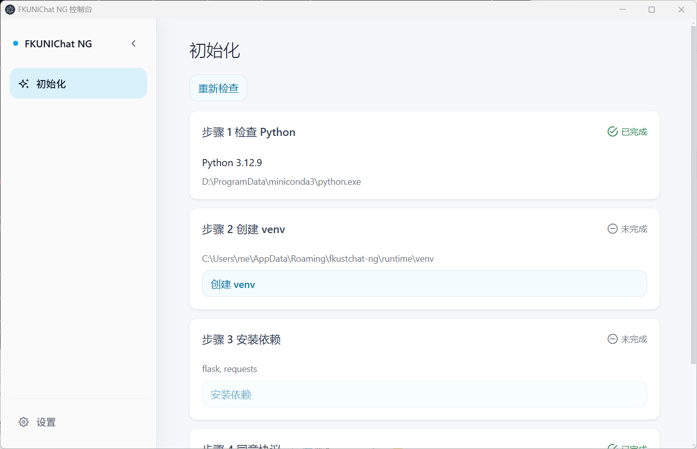
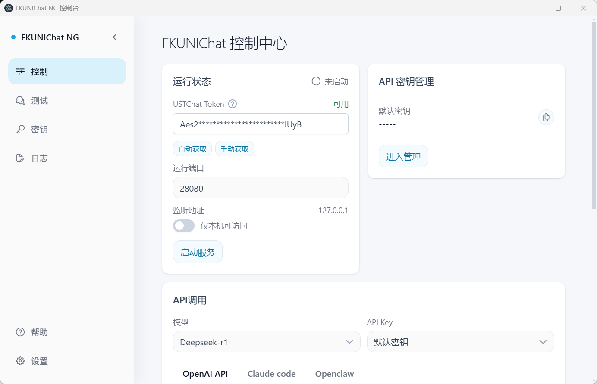
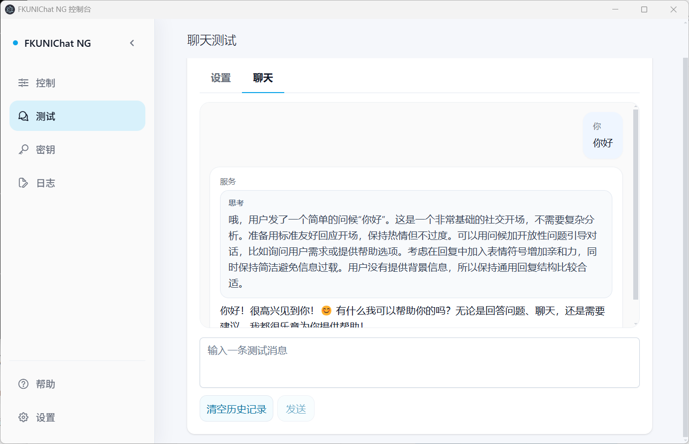
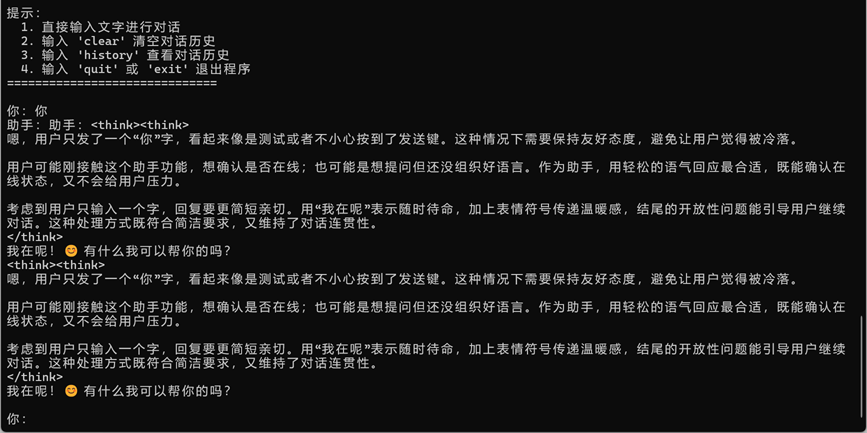
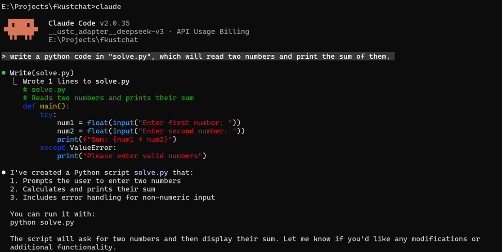

# FKUNIChat 🚀 NG

### 项目简介

FKUNIChat 是一款给 USTChat（https://chat.ustc.edu.cn）制作的 API 兼容层，能将 USTChat 用 OpenAI、Claude Code 等格式导出，支持在 Python、Claude Code、OpenClaw 中调用。

- 博客链接：[https://blog.yemaster.cn/post/170](https://blog.yemaster.cn/post/170)

> [!Warning]
>
> 该项目仍然在测试中，不稳定，可能会出现错误。有问题请提交 Issue。

### 🎪 支持模型

**USTC Chat 系列** (需科大账号登录)

- 🤖 DeepSeek r1 - 强大的推理模型
- 🧠 DeepSeek v3 - 最新版本，性能卓越

## 🚀 快速开始

### 系统要求

支持系统：

- Windows 10/11 x64
- Linux x64/arm64
- Mac OS x64

需要提前安装 Python 并放入环境变量，并从 [Releases 页面](https://github.com/yemaster/FKUNIChat/releases) 下载最新版本的安装包。

### 初始化程序

打开程序后，会自动检查环境，如果不符合要求，点击按钮就可以自动创建 Python 虚拟环境并安装项目依赖。



启动程序后，建议首先自动获取 USTChat Token，系统会自动打开 USTChat 官网，登陆后就会自动获取 Token 并填入。



然后即可启动程序。

默认密钥为空密钥，你也可以自己创建密钥。

## 📚 调用示例

### Claude Code 调用

配置环境变量：

```env
ANTHROPIC_BASE_URL=http://127.0.0.1:5000/
ANTHROPIC_AUTH_TOKEN=a-random-string
ANTHROPIC_MODEL=__USTC_Adapter__deepseek-v3
```

然后启动 `claude` 即可。

### 代码调用

API 地址：`http://127.0.0.1:28080`，API KEY：自由配置。

### 🎇项目截图

#### 网页聊天



#### API 调用



#### Claude Code 调用



### 🛠️ 开发者指南

### 🤝 贡献指南

我们热烈欢迎社区贡献！🌟

1. Fork 本仓库
2. 创建功能分支：`git checkout -b feature/AmazingFeature`
3. 提交更改：`git commit -m 'Add some AmazingFeature'`
4. 推送分支：`git push origin feature/AmazingFeature`
5. 开启 Pull Request

### TODO List

- [ ] 自动化构建
- [ ] 自动更新

### 📝 更新日志

- **v2.0.0 (ng)** 新增客户端 GUI 界面，更易操作，删除 adapter 设计。
- **v1.1.0** 🎉 新增兼容 Claude Code 的 API
- **v1.0.1** 🎉 为 USTC Chat 支持 Tool Calls
- **v1.0.0** 🎉 初始版本发布，支持 USTC Chat 系列模型
- 更多功能正在开发中...

### ⚠️ 注意事项

- 请合理使用 API，避免过度频繁调用
- 遇到问题请查看日志文件或提交 Issue

### 📄 许可证

本项目采用 MIT 许可证 - 查看 [LICENSE](license) 文件了解详情。

------

**开始你的多模型 AI 之旅吧！** 🚀✨

*如有问题或建议，欢迎提交 Issue 或参与讨论！*
